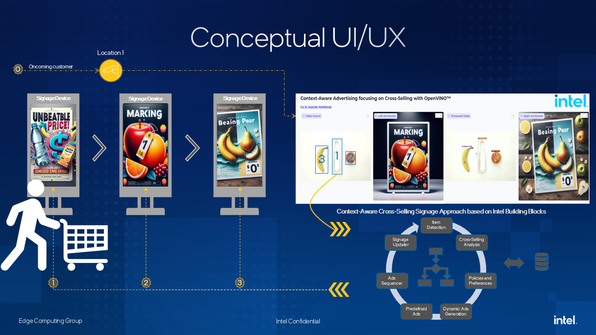
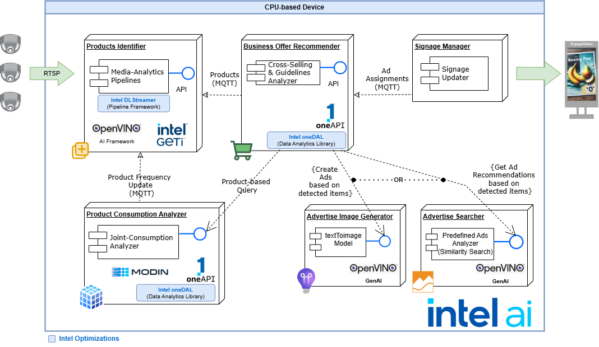

# Context-aware Cross-Selling Digital Signage Approach

Initial Stage for the Context-aware, Cross-Selling Digital Signage Approach based on the US Patent US20220366478A1.

## Conceptual Approach

Our customer (Intel Customer) is an ISV or SI providing solutions on top of the Intel building blocks (Software or Hardware). In terms of User experience( UX), we refer to customers (in general) consuming the services and ads offered through the digital signage edge devices.

**Figure 1**. High-level UX Approach

When a customer is walking in a store line (for example, retail), the items in the basket are detected through a camera. Then, the associated items to the detected ones are analyzed in near real-time, aligned with the company preferences (optional guidelines) and policies (mandatory guidelines) to create one or more ads following the associations dynamically. Alternatively, it could show related Institutional ads most related to the detected items when no explicit items are detected.

The set of ads follows brand guidelines and is shown in a sequence according to the established directives. This sequence of ads is shown through the digital signage devices while the customer is walking through.

Object detection and associations allow it to dynamically create customer consumption profiles without personal data or a loyalty program. It focuses on analyzing the joint occurrence of detected items to see the intention of buying an item (or even abandoning it, leaving it in some place in the store).

Additionally, this approach allows it to contrast the buying intention with the transactions per store to measure the gap between bought and wished items using anonymous data.

## High-Level Architecure and Component Diagram

The following component diagram describes the high-level approach to implement a Proof-of-Concept (POC), reusing as many Intel Building Blocks (BB) as possible.

**Figure 2**. High-Level Architecture and Components' Approach

It is possible to identify six main components:

1. **Products Identification (PID)**: It receives the video streaming from a camera (or presetted demo video), carries out the video-analytic pipeline, detects and classifies the items, and informs them through MQTT. It offers an API to manage pipelines and involved AI models.
1. **Product Consumption Analyzer (PCA)**: On the one hand, it reads the MQTT notifications and updates the joint occurrences for detected items. When no previous information is available, it allows it to start from scratch, addressing the Cold-start mitigation risk. On the other hand, an API can incorporate transactional data and detect association rules from it.
1. **Business Offer Recommender (BOR)**: It receives the recognized items and detection sequence to analyze related ones offered in a given order through ads, following the brand guidelines, policies, and preferences.It determines whether to use a predefined advertisement driving a similarity search, or instruct to generate a set of new ones following a certain idea. Once solved, it will update the ads record to be consumed by the signage manager.
1. **Advertise Image Generator (AIG)**: It creates an Image-based ad following the provided text description, brand guidelines, preferences, and policies.
1. **Advertise Searcher (ASe)**: It looks for the closest predefined ad using its description based on the query. It orders the response sequence accordingly.
1. **Signage Manager (SMg)**: It reads the ads record and updates the digital signage edge devices accordingly.

Table 1 describes BB used per component and their purpose as following:

**Table 1.** Relationship between the main architecture components and Intel Building Blocks (BB)

| Component                                                        |  Intel DLStreamer Pipeline Server   |   Intel Geti   | Intel onAPI > OneDAL |   Intel OpenVINO   |             MODIN              |
| ---------------------------------------------------------------- | :---------------------------------: | :------------: | :------------------: | :----------------: | :----------------------------: |
| [Product Identification (PID)](./caxselling/pid/README.md)       | Object Detection and Classification | Model Training |         ---          | Model Optimization |              ---               |
| [Product Consumption Analyzer (PCA)](./caxselling/pca/README.md) |                 ---                 |      ---       |  Association Rules   |        ---         | Optimized DataTable Management |
| [Business Offer Recommender (BOR)](./caxselling/bor/README.md)   |                 ---                 |      ---       | Guidelines Analysis  |        ---         |              ---               |
| [Advertise Image Generator (AIG)](./caxselling/aig/README.md)    |                 ---                 |      ---       |         ---          |     Text2Image     |              ---               |
| [Advertise Searcher (ASe)](./caxselling/ase/README.md)           |                 ---                 |      ---       |         ---          |        ---         |       Similarity Search        |
| [Signage Manager (SMg)](./caxselling/smg/README.md)              |                 ---                 |      ---       |         ---          |        ---         |              ---               |

Under the caxselling folder ([See the corresponding README.md file](./caxselling/README.md)), you could find a set of folders per component with the corresponding source code,
configuration, and associated guides.
