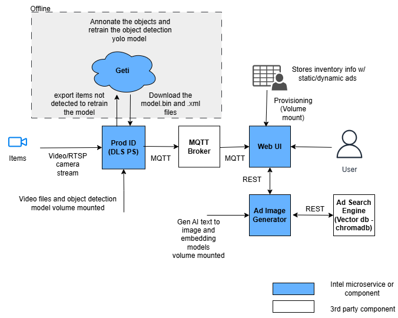

# Digital Signage: Context-Aware, Cross-Selling

## Overview
The Context-Aware, Cross-Selling Digital Signage application is a fully containerized, end-to-end solution from product detection to 
dynamic advertisement generation using Intel AI and media pipelines.
The architecture follows a microservices design pattern and enables optimized edge deployment on Intel® platforms in retail and similar environments.

**Key Features:**
- **Product Provisioning:** Configure product items with predefined advertisements, slogans, promotional offers, and pricing
- **Context-Aware Detection:** Real-time product identification from video streams (file-based or RTSP camera input)
- **Cross-Sell & Up-Sell Recommendations:** Intelligent suggestion logic based on detected products and contextual data
- **Hybrid Advertisement Display:** Serves predefined ads for provisioned products or generates dynamic ads via generative AI when not provisioned
- **Interactive Web Interface:** Live video stream visualization with near real-time advertisement rendering
- **Containerized Deployment:** Single-node deployment via Docker Compose
- **Intel® Optimized AI Pipeline:**
   - DL Streamer Pipeline Server for video frames ingestion and analytics
   - OpenVINO™ GenAI for generating the dynamic advertisement based on the detected item


## Minimum System Requirements

- **CPU:** Intel(R) Core(TM) Ultra (Series 2) processor or above having at least 16 cores
- **RAM:** 16 GB minimum (32 GB recommended)
- **Disk:** 500 GB free space
- **GPU:** Intel® iGPU
- **OS:** Ubuntu 24.04 LTS
- **Docker:** Docker Engine 24.x+, Docker Compose v2
- **Network:** Access to internet for model downloads and container pulls

## Architecture

The solution is composed of the following main components:

1. **Product Identification (PID):**
   - Detects products in video streams using DL Streamer Pipeline Server and YOLO models (Can be replaced w/ Geti trained models).
   - Publishes detection results via MQTT.
2. **Advertise Image Generator (AIG):**
   - Generates custom advertisements using generative AI (Stable Diffusion XL Turbo, MiniLM, etc.).
   - Supports logo, slogan, and price overlays.
3. **Advertise Searcher (ASe):**
   - Retrieves and ranks relevant ads based on detected products and context.
   - Uses ChromaDB for vector search.
4. **Web UI:**
   - Provides a browser-based interface for video and ad display.
   - Integrates with AIG and PID for real-time updates.

**Supporting Services:**
- **MediaMTX:** WebRTC streaming relay
- **Mosquitto:** MQTT broker for inter-service communication
- **ChromaDB:** Vector database for ad search
- **COTURN:** TURN server for WebRTC

**High-Level Architecture:**



## Web UI: Object Selection and Ad Generation Flow

The Web UI service subscribes to object-detection events and decides which product should drive the next advertisement. The process is designed to reduce noise, avoid repeated content, and prioritize useful promotions.

### 1. Detection Ingestion from PID

- The Web UI subscribes to the configured MQTT topic for detection results from PID.
- Incoming labels are normalized to lowercase before processing.
- Only labels with valid confidence values are considered.

### 2. Temporal Filtering and Confidence Gating

- The service keeps a short rolling history of recent detection frames.
- A label is considered eligible only if it appears in at least N recent frames (configured by `OBJECT_RECENCY_FRAME_COUNT`).
- The label must also satisfy the configured confidence threshold (`OBJECT_CONFIDENCE_THRESHOLD`).

This helps prevent one-off false positives from triggering ad generation.

### 3. Mapping Labels to Provisioned Products

- Eligible labels are matched against `web-ui/ProductAssociations.csv`.
- Labels that are not present in the CSV are skipped.
- Duplicates are removed so each product appears once in the candidate set.

### 4. Product Selection Strategy

When multiple products are eligible:

- First-time priority: products that have never been shown are prioritized by highest configured price.
- Rotation mode: once products have been shown, selection rotates across candidates by preferring less-shown products.
- Immediate repeat prevention: if alternatives exist, the most recently selected product is temporarily avoided.

This provides an intentional blend of merchandising priority and content variety.

### 5. Ad Variant Selection per Product

- A product can have multiple rows in `ProductAssociations.csv`.
- For repeated appearances of the same product, the Web UI avoids reusing the exact same variant index consecutively when alternatives exist.

### 6. Predefined Ad First, Dynamic Ad Fallback

For each selected product:

- The service first queries ASe for a predefined ad (`/ase/predef/query/ad`).
- If a predefined ad is found, it is displayed immediately.
- If no predefined ad is found, the service calls AIG (`/aig/minf/`) to generate a dynamic advertisement using the configured text/promo/price/slogan payload.

### 7. Delivery to Browser Clients

- The current ad is served through the Web UI endpoint `/get_current_advertisement`.
- Client IDs are tracked so each client receives a new ad once per generation cycle.
- A display interval (`TIME_TO_DISPLAY_AD_SECONDS`) controls how frequently new ads are generated.

### 8. Provisioning Inputs That Control Behavior

The following inputs drive what the Web UI can select and display:

- `web-ui/ProductAssociations.csv`: product, pricing, promo text, slogan, cross-sell target, dynamic prompt, and optional predefined image file.
- `web-ui/pre-defined-ads/`: optional predefined JPEG/JPG assets referenced by the CSV.
- Environment variables in `.env`: MQTT settings, timing values, and confidence/recency thresholds.


## Repository Structure

```
digital-signage/
├── aig/         # Advertise Image Generator (AIG) microservice
├── pid/         # Product Identification (PID) microservice
├── web-ui/      # Web-based user interface
├── diagrams/    # Architecture diagrams
├── docker-compose.yml
├── Makefile
├── .env         # Main environment configuration
└── ...
```

## Quick Start

### Clone Source Code

```bash
git clone https://github.com/intel-retail/digital-signage
cd digital-signage
```

### Build & Prepare Models

> **NOTE:** Run all commands as a regular (non-root) user, without using `sudo`.

#### 1. Download YOLO11s Model (for PID)

> Please review the [YOLO11s license](https://github.com/ultralytics/ultralytics/blob/main/LICENSE).

```bash
cd pid && \
wget https://raw.githubusercontent.com/intel-retail/automated-self-checkout/v3.6.3/download_models/downloadAndQuantizeModel.sh && \
sed -i 's|MODELS_PATH="${MODELS_DIR:-/workspace/models}"|MODELS_PATH="${MODELS_DIR:-$PWD/models}"|g' downloadAndQuantizeModel.sh && \
sed -i 's/MODEL_NAME="yolo11n"/MODEL_NAME="yolo11s"/g' downloadAndQuantizeModel.sh && \
rm -rf .modelenv && \
python3 -m venv .modelenv && \
source .modelenv/bin/activate && \
pip3 install -r model_download_requirements.txt && \
rm -rf models && \
chmod +x downloadAndQuantizeModel.sh && \
./downloadAndQuantizeModel.sh && \
rm ./downloadAndQuantizeModel.sh && \
deactivate && \
cd ..
```
The quantized model will be saved to `./pid/models/object_detection/yolo11s`.

#### 2. Download SDXL-Turbo and MiniLM Models (for AIG)

> Please review the [SDXL-Turbo license](https://huggingface.co/stabilityai/sdxl-turbo/blob/main/LICENSE.md).

```bash
cd aig && \
rm -rf .modelenv && \
python3 -m venv .modelenv && \
source ./.modelenv/bin/activate && \
pip3 install -r export-requirements.txt && \
export HF_HUB_ENABLE_HF_TRANSFER=1 && \
optimum-cli export openvino --model stabilityai/sdxl-turbo --task stable-diffusion-xl --weight-format int8 ./models/sdxl_turbo_ov/int8 && \
huggingface-cli download sentence-transformers/all-MiniLM-L12-v2 --local-dir ./models/all-MiniLM-L12-v2 && \
deactivate && \
cd ../
```
Models will be downloaded to `./aig/models/`.

### Build Docker Images

```bash
make build
```

### Configuration

1. Edit the `.env` file and configure the following variables (refer to the comments in the file for additional guidance):

   - `HOST_IP`: Specify the host system IP address.
   - `MTX_WEBRTCICESERVERS2_0_USERNAME`: Set a username with a minimum of 5 alphabetic characters.
   - `MTX_WEBRTCICESERVERS2_0_PASSWORD`: Set a password with at least 8 alphanumeric characters, including at least one digit.
   - *(Optional)* Configure `RTSP_CAMERA_IP`, `AIG_*`, and `ASE_*` variables for advanced settings as needed.

2. *(Optional)* To enable pre-defined advertisements, update the [web-ui/ProductAssociations.csv](web-ui/ProductAssociations.csv) file and the [web-ui/pre-defined-ads/](web-ui/pre-defined-ads/) directory accordingly. The CSV file should reference image filenames located in the `pre-defined-ads` directory. Please note that only JPEG/JPG image formats are supported.


### Deploy the Application


```bash
make up
```
This command validates your environment configuration, verifies that required models are available, 
removes any previously running containers, and starts all containers.

### Access the Web Interface

Open Google Chrome and navigate to:

```
http://<HOST_IP>:5000
```

For local systems with limited compute resources, follow the step below for better results:

1. Open Terminal on the desktop.
2. Run the command below to launch Chrome with GPU acceleration disabled:
   ```bash
   google-chrome --process-per-site --disable-plugins --disable-gpu http://localhost:5000
   ```


You should see the live video stream and dynamic advertisements.

### Verify & Monitor
Check container status:

```bash
docker ps
```

If any container is restarting, check logs:

```bash
docker logs -f <container_name>
```

### Undeploy

To stop and remove all containers and volumes:

```bash
make down
```

---

## Changing Inferencing Device (CPU/GPU/NPU)

By default, the PID component performs inference on the `CPU`, while the AIG component uses the `GPU`. You can customize the target device for AI inferencing in both components as follows:

### PID (Product Identification)

- **Configuration:** Update the `device` parameter within `pid/config.json`.
- **Example:**

   ```json
   "parameters": {
      "detection-properties": {
         "model": "<model_path>",
         "device": "CPU"
      }
   }
   ```

- **Available options:** `CPU`, `GPU`, or `NPU`

### AIG (Advertise Image Generator)

- **Configuration:** Set the `AIG_MODEL_DEVICE` variable in the `.env` file.
- **Example:**
   ```env
   AIG_MODEL_DEVICE=GPU
   ```
- **Available options:** `CPU` or `GPU`

After updating the device configuration, redeploy the application to apply changes:
```bash
make down
make up
```


## REST API Documentation

### AIG (Advertise Image Generator) REST API

The AIG service exposes REST endpoints for generating and managing advertisements.

**Base URL:** `http://<HOST_IP>:<AIG_PORT>` (By default, `AIG_PORT` value is set to 5003 in `.env` file)

#### Key Endpoints

- `POST /aig/minf/`
   - **Description:** Generate an advertisement image from input text and parameters (logo, slogan, price, etc.).
   - **Request Body (JSON):**
      ```json
      {
         "prompt": "string",         // Description for image generation
         "logo_path": "string",     // (optional) Path to logo file
         "slogan": "string",        // (optional) Slogan text
         "price": "string"          // (optional) Price text
      }
      ```
   - **Response:** Image (binary or base64-encoded)

- `POST /ase/predef/`
   - **Description:** Store a predefined advertisement in the database.
   - **Request Body:** Ad metadata and image

- `POST /ase/predef/query/ad`
   - **Description:** Query for relevant ads based on product/context.
   - **Request Body:** Query parameters
   - **Response:** List of matching ads

---

### PID (Product Identification) REST API

The PID service (DL Streamer Pipeline Server) exposes REST endpoints for pipeline management and status.

**Base URL:** `http://<PID_HOST>:8080`

For REST API docs, refer [link](https://docs.openedgeplatform.intel.com/2025.2/edge-ai-libraries/dlstreamer-pipeline-server/api-reference.html)

## Advanced Configurations

### Switch the Simulation Video

1. Copy the simulation video to the `pid/resources/videos` directory.
   > Note: The input file must be in `.avi` format.
2. Edit `pid/config.json` and replace `<VIDEO_FILE_NAME>` in the pipeline string with your uploaded filename (without extension):
   
   ```json
   "multifilesrc loop=TRUE location=/home/pipeline-server/resources/externalvideos/<VIDEO_FILE_NAME>.avi name=source ! h264parse ! decodebin ! videoconvert ! video/x-raw,format=BGR ! gvadetect name=detection ! queue ! gvawatermark ! gvafpscounter ! appsink name=destination",
   ```
3. Redeploy with `make down && make up`.

### RTSP Camera Configuration

1. **Obtain RTSP URI** from your camera software (test with VLC if needed).
2. Edit `pid/config.json` and update the `pipeline` string:

   ```json
   "pipeline": "rtspsrc location=\"rtsp://<USERNAME>:<PASSWORD>@<RTSP_CAMERA_IP>:<PORT>/<FEED>\" latency=100 name=source ! rtph264depay ! avdec_h264 ! videoconvert ! videoscale ! video/x-raw,format=BGR,width=1280,height=720 ! gvadetect name=detection ! queue ! gvawatermark ! gvafpscounter ! appsink name=destination"
   ```
3. Set `RTSP_CAMERA_IP` in `.env`.
4. Redeploy with `make down && make up`.

For more on RTSP, see [RTSP protocol](https://en.wikipedia.org/wiki/Real_Time_Streaming_Protocol) and [DL Streamer Pipeline Server RTSP guide](https://docs.openedgeplatform.intel.com/2025.2/edge-ai-libraries/dlstreamer-pipeline-server/advanced-guide/detailed_usage/camera/rtsp.html#rtsp-cameras).

### Using Intel® Geti™ Exported Model

> **Prerequisites:**
> 1. Refer to the [official Geti documentation for offline installation instructions](https://docs.geti.intel.com/docs/user-guide/getting-started/installation/using-geti-installer). DL Streamer Pipeline Server is using 2.13.1 geti sdk version, install the same or latest geti version as per [compatibility](https://docs.geti.intel.com/docs/user-guide/geti-fundamentals/deployments/?_highlight=compatible#compatibility)
> 2. See the [Geti Tutorials](https://docs.geti.intel.com/docs/user-guide/getting-started/use-geti/tutorials) for step-by-step guides on creating projects, labeling data, training models, and exporting results.
> 3. Review the [Supported Models in Geti](https://docs.geti.intel.com/docs/user-guide/getting-started/use-geti/supported-models) to ensure your project uses a YOLO or other object detection architecture for export to OpenVINO™ IR format.
> 4. Follow the [Model Download Instructions](https://docs.geti.intel.com/docs/user-guide/geti-fundamentals/deployments/#lets-download-the-model) to export your trained model as OpenVINO™ IR files (`.xml`/`.bin`). This process includes selecting the correct export format and downloading the files for deployment.


1. **Export** your Geti model from Intel® Geti™ as OpenVINO™ IR (`.xml`/`.bin`).
   If you have downloaded Geti deployment project, just extract the .zip package
   and place the extracted folder at `./pid/models/object_detection/geti-sdk-deployment/deployment/Detection/model`.
2. Edit the `pid/config.json` file to update the `model` parameter to point to your exported model file:

   ```json
   "parameters": {
      "detection-properties": {
         "model": "/home/pipeline-server/object_detection/geti-sdk-deployment/deployment/Detection/model/<YOUR_MODEL_NAME>.xml",
         "device": "CPU"
      }
   }
   ```
   Replace `<YOUR_MODEL_NAME>` with the actual filename (without extension) of your exported model.

4. Redeploy the application to apply changes:

   ```bash
   make up
   ```
5. Check logs for model loading success:

   ```bash
   docker logs -f <pid_container_name>
   ```

---

## License

This project is licensed under the Apache 2.0 License. See [LICENSE](LICENSE) for details.

