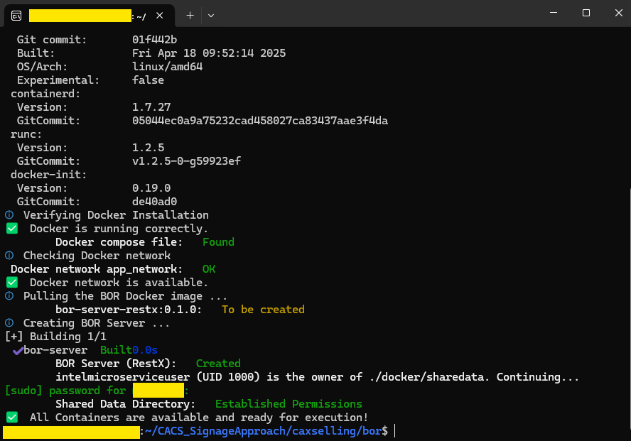
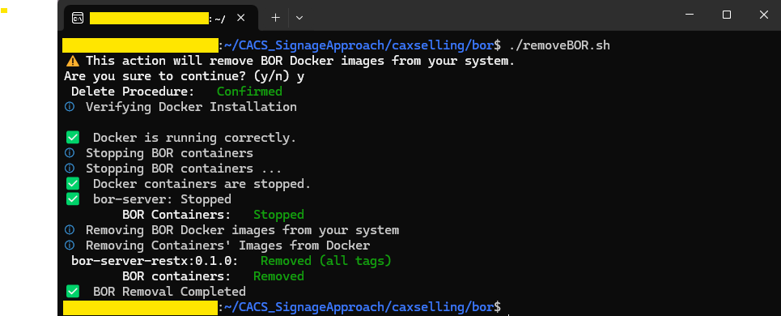
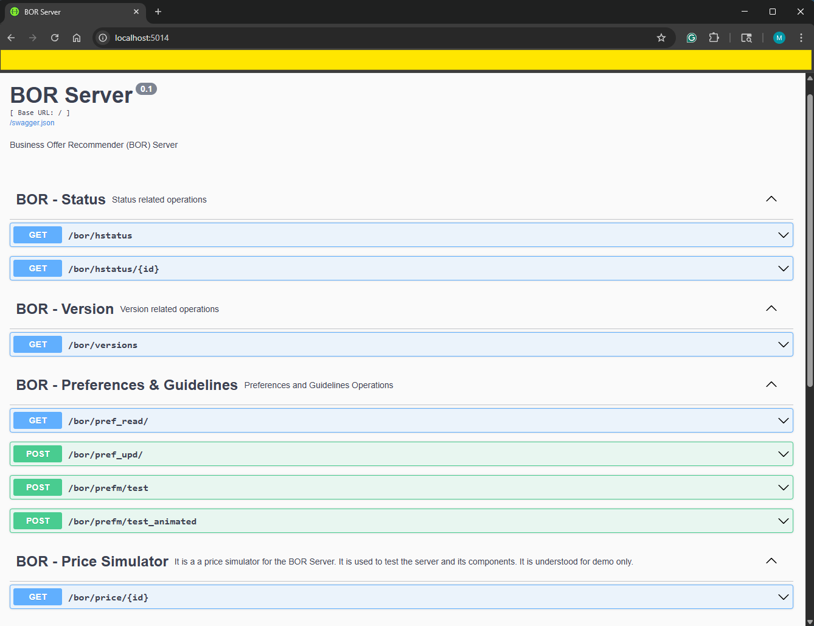

# Business Offer Recommender (BOR)

| [Project Readme.md](../../README.md) | [CAXSelling Readme.md](../README.md) |

It describes functionalities and package organization for the Business Offer Recommender (BOR). It analyzes the detected items and their sequences, analyzes the policies and guidelines, and looks for products that complimentary the items to offer them based on the detected sequence potentially.

Content:

- [Conceptual Approach and Container Initialization](#conceptual-approach-and-container-initialization)
  - [BOR Server Configuration](#configuration)
  - [Database](#database-tables)
  - [Preferences and Guidelines Parameters](#preferences-and-guidelines-parameters)
- [Management Scripts](#management-scripts)
- [Testing BOR Server](#testing-bor-server)

## Conceptual Approach and Container Initialization

The [docker compose file](./docker/docker-compose.yml) starts the BOR Server. It allows it to define guidelines and preferences to monitor the detected items from the MQTT broker and how to drive the strategy to look for cross-sell items (or product likelihoods) and generate the ads based on the defined directives.

The output topic is dynamically created by adding a suffix (defined in the preferences) for each MQTT topic under monitoring.

The folder organization is as follows:

```bash
├ docker
│   └─ sharedata # Shared folder between the host and BOR Server (Import/Export)
├ src # BOR Server (Source Code)
├ Dockerfile #It defines how to build and start the BOR Server
├ installBOR.sh # The installation Script
├ runBOR.sh # The initialization and check Script
├ removeBOR.sh # The removal Script
```

### Configuration

The [sample.env](./docker/sample.env) file is a sample configuration file. If you want to reuse it, update the corresponding values (See Table below) and rename it to .env before starting the containers.

|Group | Variable|Objective|Observation|
|---|---|---|---|
|bor-server|PCA_SERVER_PROTOCOL|Protocol to get access to the PCA Server|Default: "http://"|
|bor-server|PCA_SERVER_HOST|The host name for the PCA Server|Default: "pca-server"|
|bor-server|PCA_SERVER_PORT|Port number to get access to the PCA Server API| Default: 5002|
|bor-server|MQTT_BROKER_PROTOCOL|Protocol to get access to the MQTT Broker managing the object identification topic under monitoring|Default: "mqtt://"|
|bor-server|MQTT_BROKER_HOST|The host name for the MQTT Broker managing input and output topics|Default: "mqtt_broker"|
|bor-server|MQTT_BROKER_PORT|Port number to get access to the MQTT broker|Default: 1883|
|bor-server|AIG_SERVER_PROTOCOL|Protocol to get access to the AIG Server|Default: "http://"|
|bor-server|AIG_SERVER_HOST|The host name to get access to the Ads Image Generation Server| Default: "aig-server"|
|bor-server|AIG_SERVER_PORT|Port number to get access to the AIG Server API| Default: 5003|
|bor-server|UID|BOR Admin user uid|Default: 1999|
|bor-server|BOR_SERVER_USER|BOR Server admin user|Default: intelmicroserviceuser|
|bor-server|BOR_SERVER_PORT|BOR Port Number|Default: 5014|
|bor-server|BOR_SYNC_ENABLED|It runs a synchronization with monitored topics in the PCA server at start-up. After it, a value of 1 in this parameter will enable an independent thread for frequent synchronization with the PCA Server. The synchronization is disabled when this parameter is zero.|Default: 0|
|bor-srver|BOR_SYNC_INTERVAL|Synchronization interval in seconds with the PCA server when BOR_SYNC_ENABLED is 1|Default: 300|
|bor-server|BOR_DEFAULT_PREF_DB|The Default SQLite database to store and manage the parameters related to preferences, guidelines, and ads|Default: "/data/bor_pref_db.sqlite"|
|proxy|http_proxy|environment variable with http proxy information| Default: ${http_proxy}|
|proxy|https_proxy|environment variable with https proxy information| Default: ${https_proxy}|
|proxy|no_proxy|environment variable for the address that the proxy is not required| Default: ${no_proxy}|

[&uarr; Top](#business-offer-recommender-bor)

### Database Tables

The BOR server uses a SQLite database to store parameters related to preferences, guidelines, and ads. All parameters are managed and retrieved from the *preferences* table. The following table synthesizes its organization.

|Column|Type|Objective|Null|Observation|
|---|---|---|---|---|
|category|text|Belonging category for the parameter|NOT NULL|PK|
|parameter|text|The parameter name|NOT NULL|PK|
|value|text|The parameter value expressed as a string|NOT NULL||
|type|text|Original Python data type in Python|NOT NULL||

The primary key is composed of the category and parameter fields. The category field can assume four values:

- **predefined_ads**: Parameters and preferences ruling the ad composition based on predefined ads in the ASE server.
- **dynamic_ads**: Parameters and preferences ruling the ad composition for those ads dynamically generated through the AIG Server.
- **digital_signage**:  Parameters and preferences that rule the output delivery once ads have been collected or generated.
- **price**: Parameters defining the endpoint from which to recover product prices.

[&uarr; Top](#business-offer-recommender-bor) | [&uarr; Database Tables](#database-tables)

### Preferences and Guidelines Parameters

#### Ads (Dynamic and Predefined)

The same parameters are independently stored and managed for the dynamically generated ads and the predefined ads.

|Parameter | Tag|Type|Objective|Default|
|---|---|---|---|---|
|AD_ENABLE_LOGO|enable_logo|Boolean|It decides whether enable (1) or disable (0) the logo in the  ad|True |
|AD_LOGO_HALIGN|logo_halign|String|The horizontal alignment when the logo is enabled (left, right, or center)|left|
|AD_LOGO_VALIGN|logo_valign|String|The vertical alignment when the logo is enabled (top, middle, or bottom)|top|
|AD_LOGO_PERCENTAGE|"logo_percentage"|Float|Percentjae relative to the image picture to scale the logo|15.0|
|AD_LOGO_MARGIN_PX|logo_margin_px|Float|Retirement margin in pixels between the logo and the borders|10|
|AD_ENABLE_SLOGAN_DEFINITION|enable_slogan_definition|Boolan|Define whether the slogan is enabled (1) or no (0)|True|
|AD_SLOGAN_TEXT|slogan_text|String|The slogan text|The Best price in town|
|AD_SLOGAN_TEXT_COLOR|slogan_text_color|String|The slogan text color according to [Pillow](https://pillow.readthedocs.io/en/stable/reference/ImageColor.html)|white|
|AD_SLOGAN_FONT_SIZE|slogan_font_size|Integer|The font size for the slogan text|18|
|AD_SLOGAN_HALIGN|slogan_halign|String|The horizontal alignment when the slogan is enabled (left, right, or center)|right|
|AD_SLOGAN_VALIGN|slogan_valign|String|The vertical alignment when the logo is enabled (top, middle, or bottom)|top|
|AD_SLOGAN_MARPERF_FROM_BORDER|slogan_marperc_from_border|Float|Retirement margin percentage between the slogan and the borders|5.0|
|AD_SLOGAN_LINE_WIDTH|Integer|slogan_line_width|The slogan text width|20|
|AD_ENABLE_PRICE|enable_price|Boolean|It decides whether enable (1) or disable (0) the price in the ad|True|
|AD_PRICE_TEXT_COLOR|price_text_color|String|The price color according to [Pillow](https://pillow.readthedocs.io/en/stable/reference/ImageColor.html)|white|
|AD_PRICE_FONT_SIZE|price_font_size|Integer|The price font size|24|
|AD_PRICE_LINE_WIDTH|price_line_width|Integer|The price line width|5|
|AD_PRICE_IN_CIRCLE|price_in_circle|Boolean|It decides whether enable (1) or disable (0) a circle containing the price in the ad|True|
|AD_PRICE_CIRCLE_COLOR|price_circle_color|String|The circle color according to [Pillow](https://pillow.readthedocs.io/en/stable/reference/ImageColor.html)|black|
|AD_PRICE_HALIGN|price_halign|String|The horizontal alignment when the price is enabled (left, right, or center)|left|
|AD_PRICE_VALIGN|price_valign|String|The vertical alignment when the logo is enabled (top, middle, or bottom)|bottom|
|AD_PRICE_MARPERF_FROM_BORDER|price_marperc_from_border|Float|Retirement percentage relative to the figure size between the price and the borders|10.0|
|AD_ENABLE_PROMOTIONAL_TEXT|enable_promotional_text|Boolean|It decides whether enabled (1) or not (0) the promotional text|True|
|AD_PROMO_TEXT|promo_text|String|The promotional text|Get one pound and get 50%% off in the second!|
|AD_PROMO_TEXT_COLOR|promo_text_color|String|The promotional text color according to [Pillow](https://pillow.readthedocs.io/en/stable/reference/ImageColor.html)|black|
|AD_PROMO_FONT_SIZE|promo_font_size|Integer|The promotional text font size|20|
|AD_PROMO_LINE_WIDTH|promo_line_width|Integer|The promotional text line width|10|
|AD_PROMO_RECT_COLOR|promo_rect_color|String|The rectangle color (according to [Pillow](https://pillow.readthedocs.io/en/stable/reference/ImageColor.html)) in which the promo text is included|black|
|AD_PROMO_RECT_PADDING|promo_rect_padding|Integer|The rectangle padding for the promotional text|10|
|AD_PROMO_RECT_RADIUS|promo_rect_radius|Integer|The rectangle radius for the promotional text|20|
|AD_PROMO_HALIGN|promo_halign|String|The horizontal alignment when the promotional text is enabled (left, right, or center)|left|
|AD_PROMO_VALIGN|promo_valign|String|The vertical alignment when the promotional text is enabled (top, middle, or bottom)|bottom|
|AD_PROMO_MARPERF_FROM_BORDER|promo_marperc_from_border|Float|Retirement margin percentage between the promotional text and the borders|10.0|
|AD_ENABLE_FRAME|enable_frame|Boolean|It enables (1) or not (0) the frame in the ad|True|
|AD_FRAME_MARPERF_FROM_BORDER|frame_marperc_from_border|Float|Retirement margin percentage between the frame and the borders|5.0|
|AD_QUERY_DEVICE|query_device|String|The device to be used for ad generation (or searching)|GPU|
|AD_QUERY_COMPLEMENT|query_complement|String|Complement text to be incorporated in the prompt for the detected item (for example, 8k or picture quality)|8k|
|AD_SERVICE_PATH|service_path|String|Path to the service that provides ads"| ASE: "/ase/predef/query/ad" AIG: "/aig/minf"|

[&uarr; Top](#business-offer-recommender-bor) | [&uarr; Preferences and Guidelines Parameters](#preferences-and-guidelines-parameters)

#### Digital Signage

The following parameters apply to the digital signage.

|Parameter | Tag|Type|Objective|Default|
|---|---|---|---|---|
|DS_MIN_TIME_BETWEEN_ADS_SUBMISSION|min_time_between_adsubmission|Integer|The minimum time in seconds between ads (update rate)|90|
|DS_OUTPUT_SEQUENCE|output_sequence|String|A list combinining PREDEFINED and DYNAMIC to decide the number, type, and order for the delivered set of ads| [PREDEFINED\|DYNAMIC\|PREDEFINED]|
|DS_OUTPUT_SUFFIX|output_suffix|String|Suffix to be added to the monitored topic to create the output topic in the MQTT Broker|_output|
|DS_OUTPUT_ADD_ANIMATION|output_add_animation|Boolean|If true, it adds an animated GIF based on the received images and it is added as an extra in the output|True|
|DS_OUTPUT_ANIMATION_MIN_MS_PER_IMG|output_animation_min_ms_per_img|Integer|The animation duration in ms|1000|
|DS_DEFAULT_CONCEPT|default_concept|String|Default concept when nothing is indicated|healthy food|
|DS_USE_DEFAULT_AD_WHEN_EMPTYRESULT|use_default_ad_when_emptyresult|String|It enabes (1) or not (0) the use of the default ad when no results|True|

[&uarr; Top](#business-offer-recommender-bor) | [&uarr; Preferences and Guidelines Parameters](#preferences-and-guidelines-parameters)

#### Price

The following parameters apply to the price endpoint.

|Parameter | Tag|Type|Objective|Default|
|---|---|---|---|---|
|PRICE_ENDPOINT|endpoint|String|The price endpoint (Fully qualified) from which the product price is retrieved|<http://localhost:5000/bor/price>|
|PRICE_TAG_PRICE|pricetag|String|The tag name through which the price is informed in the endpoint's reponse|price|
|PRICE_TAG_UNIT|unittag|String|The tag name through which the unit tag is informed in the endpoint's response|unit|
|PRICE_GRAL_PERC_DISCOUNT|gral_percentage_discount|Float|The general discount percentage to apply to the received price before incorporating it in the ad (when available)|1.0|

[&uarr; Top](#business-offer-recommender-bor) | [&uarr; Preferences and Guidelines Parameters](#preferences-and-guidelines-parameters)

## Management Scripts

It proposes three scripts focused on the BOR installation, delete, and running management (See Table 1).

**Table 1:** Management Scripts

|Script|Objective|Observation|
|---|---|---|
|[installBOR](./installBOR.sh)|It verifies OS compatibility and installs the image.|Preferred: Ubuntu 22.04/24.04|
|[removeBOR](./removeBOR.sh)|It stops containers and removes associated images.|It keeps dependencies|
|[runBOR](./runBOR.sh)|It starts, stops, and checks the BOR Server.|Version 0.1.0|

### Installing BOR

1. Go to the "~/.../caxselling/bor" folder
1. Run the installation script. It requires administrative permissions.

```bash
./installBOR.sh
```

Expected outcome:



The BOR Server is automatically created based on the Docker configuration and provided with enough permissions to share data between the host system and the container..

[&uarr; Top](#business-offer-recommender-bor) | [&uarr; Management Scripts](#management-scripts)

### Running BOR

The [runBOR.sh](./runBOR.sh) script allows it to start, check, and stop BOR server and the associated containers.

1. Go to the "~/.../caxselling/bor" folder
1. Run the runBOR script with the pertinent option (See the figure).


[&uarr; Top](#business-offer-recommender-bor) | [&uarr; Management Scripts](#management-scripts)

### Removing BOR

This script stops the containers (when running) and removes the associated images from Docker.

1. Go to the "~/.../caxselling/bor" folder
1. Run the removeBOR script

```bash
./removeBOR.sh
```

Expected outcome:



[&uarr; Top](#business-offer-recommender-bor) | [&uarr; Management Scripts](#management-scripts)

## Testing BOR Server

Once started the BOR Server, you can get access to the API (Default: <http://localhost:5014>).



[&uarr; Top](#business-offer-recommender-bor) | [&uarr; Management Scripts](#management-scripts)
