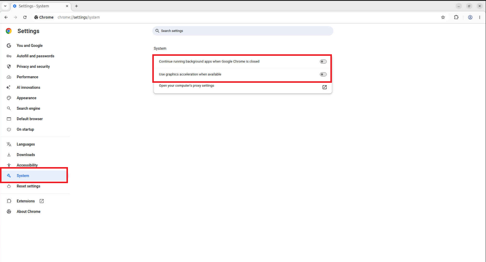

# Get Started

- **Time to Complete:** 45–60 minutes
- **Programming Language:** Python 3

## Prerequisites

- [System Requirements](./get-started/system-requirements.md)
- [Build from Source](./get-started/build-from-source.md)

## Configure Docker

To configure Docker:

1. **Run Docker as Non-Root**: Follow the steps in [Manage Docker as a non-root user](https://docs.docker.com/engine/install/linux-postinstall/#manage-docker-as-a-non-root-user).

   > **NOTE:** Run all commands as a regular (non-root) user, without using `sudo`.

2. **Configure Proxy (if required)**:
   - Set up proxy settings for Docker client and containers as described in [Docker Proxy Configuration](https://docs.docker.com/network/proxy/).
   - Example `~/.docker/config.json`:

     ```json
     {
       "proxies": {
         "default": {
           "httpProxy": "http://<proxy_server>:<proxy_port>",
           "httpsProxy": "http://<proxy_server>:<proxy_port>",
           "noProxy": "127.0.0.1,localhost"
         }
       }
     }
     ```

3. **Enable Log Rotation**:
   - Add the following configuration to `/etc/docker/daemon.json`:

     ```json
     {
       "log-driver": "json-file",
       "log-opts": {
         "max-size": "10m",
         "max-file": "5"
       }
     }
     ```

   - Reload and restart Docker:

     ```bash
     sudo systemctl daemon-reload
     sudo systemctl restart docker
     ```

## Step 1: Clone the Repository

```bash
git clone https://github.com/intel-retail/digital-signage -b main
cd digital-signage
```

## Step 2: Build Docker Images

```bash
make build
```

## Step 3: Download AI Models

Digital Signage now uses the reusable `open-edge-platform/edge-ai-libraries` model-download microservice instead of local Python virtual environments.

> Please review the [YOLO11s license](https://github.com/ultralytics/ultralytics/blob/main/LICENSE) and the [SDXL-Turbo license](https://huggingface.co/stabilityai/sdxl-turbo/blob/main/LICENSE.md) before downloading.

```bash
make download_models
```

This target:

- Pulls the pinned published `intel/model-download` microservice image digest configured by this repository
- Downloads and quantizes YOLO11s for PID
- Downloads SDXL-Turbo (OpenVINO™ INT8) and all-MiniLM-L12-v2 for AIG
- Maps the downloaded artifacts to the paths already used by Digital Signage:
  - `./configs/pid/models/object_detection/yolo11s`
  - `./aig/models/sdxl_turbo_ov/int8`
  - `./aig/models/all-MiniLM-L12-v2`

The startup model list is defined in `./configs/model-download/startup-models.yaml`.

> **Note:** If the objects are not getting detected in the pretrained YOLO11s model, use a custom object-detection model instead. See [Use Intel® Geti™ Exported Model](./how-to-guides/use-geti-model.md) for model training and export guidance.

## Step 4: Configure Environment

Edit the `.env` file in the repository root and set the following required variables:

| Variable                           | Description                                                                                       |
| ---------------------------------- | ------------------------------------------------------------------------------------------------- |
| `HOST_IP`                          | Defaults to `localhost`; use the host system IP address if you want to access the web UI remotely |
| `MTX_WEBRTCICESERVERS2_0_USERNAME` | WebRTC ICE server username (minimum 5 alphabetic characters)                                      |
| `MTX_WEBRTCICESERVERS2_0_PASSWORD` | WebRTC ICE server password (minimum 8 alphanumeric characters, at least one digit)                |

**Optional variables:**

- `RTSP_CAMERA_IP` and related RTSP settings for live camera input.
- `AIG_INFERENCE_DEVICE` to set the inference device for AIG (`CPU` or `GPU`).
- `AIG_*` and `ASE_*` variables for advanced AIG and ASe tuning.
- `OBJECT_CONFIDENCE_THRESHOLD` and `OBJECT_RECENCY_FRAME_COUNT` for detection filtering.
- `TIME_TO_DISPLAY_AD_SECONDS` for controlling ad rotation frequency.

**To enable predefined advertisements** (optional), update:

- `web-ui/ProductAssociations.csv` — product, pricing, promo text, slogan, and optional image filename.
- `web-ui/pre-defined-ads/` — JPEG/JPG image assets referenced by the CSV.

## Step 5: Deploy with Docker Compose

```bash
make up
```

This command validates your environment configuration, verifies that required models are available, removes any previously running containers, and starts all services.

## Step 6: Access the Web UI

Open Google Chrome and navigate to:

```text
https://localhost:5000
```

> **Note:** If you are accessing the UI remotely, replace `localhost` with the host system IP address.

You should see the live video stream and dynamic advertisements.

> **Note:** For local systems with limited compute resources, launch Chrome with GPU acceleration disabled:
>
> ```bash
> google-chrome --process-per-site --disable-plugins --disable-gpu https://localhost:5000
> ```
>
> Alternatively, in Chrome go to **Settings → System** and disable **Use graphics acceleration when available**, then relaunch Chrome.
> <!--hide_directive :::{dropdown} Click to see Chrome System settings screenshot hide_directive-->
> 
> <!--hide_directive::: hide_directive-->

## Step 7: Verify Output

Check that all containers are running:

```bash
docker ps
```

If any container restarts, inspect its logs:

```bash
docker logs -f <container_name>
```

## Undeploy

To stop and remove all containers and volumes:

```bash
make down
```

<!--hide_directive
:::{toctree}
:hidden:

./get-started/system-requirements
./get-started/build-from-source

:::
hide_directive-->
