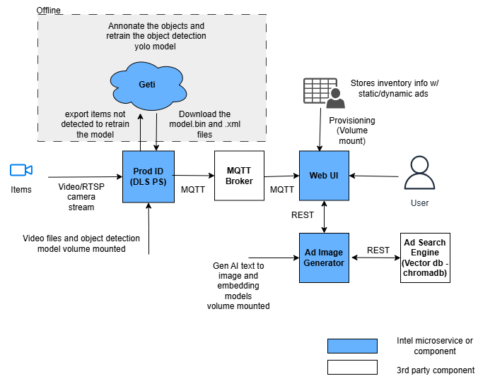

# How It Works

This page describes the end-to-end processing pipeline of the Digital Signage application, from video stream ingestion through product detection to advertisement delivery in the browser.

## High-Level Architecture

The application consists of four main microservices (PID, AIG, ASe, Web UI) plus supporting services (MediaMTX, Mosquitto, ChromaDB, COTURN) that communicate via MQTT and REST APIs.



```
Video Stream → PID (Detection) → MQTT → Web UI (Selection) → AIG or ASe (Ad) → Browser
```

## Processing Flow

### 1. Detection Ingestion from PID

- PID runs DL Streamer Pipeline Server with a YOLO model to identify products in each video frame.
- Detection results (labels + confidence scores) are published to an MQTT topic.
- The Web UI subscribes to this MQTT topic and ingests the incoming labels.
- Incoming labels are normalized to lowercase before any further processing.

### 2. Temporal Filtering and Confidence Gating

- The Web UI maintains a short rolling history of recent detection frames.
- A label is considered eligible only if it appears in at least **N** recent frames, where N is configured by `OBJECT_RECENCY_FRAME_COUNT`.
- The label must also exceed the configured confidence threshold (`OBJECT_CONFIDENCE_THRESHOLD`).

This prevents one-off false positives from triggering unwanted ad generation.

### 3. Mapping Labels to Provisioned Products

- Eligible labels are matched against `web-ui/ProductAssociations.csv`.
- Labels that do not appear in the CSV are discarded.
- Duplicates are removed so each product appears once in the candidate set.

### 4. Product Selection Strategy

When multiple products are eligible, the following prioritization applies:

| Scenario | Strategy |
|----------|----------|
| First-time products | Prioritize products never shown before, ordered by highest configured price. |
| Rotation mode | Prefer products shown less frequently across candidates. |
| Repeat prevention | Avoid the most recently selected product when alternatives exist. |

### 5. Ad Variant Selection per Product

- A product can have multiple rows in `ProductAssociations.csv`, each representing a different ad variant.
- For repeated appearances of the same product, the Web UI avoids reusing the same variant index consecutively when alternatives are available.

### 6. Predefined Ad First, Dynamic Ad Fallback

For each selected product:

1. The Web UI queries ASe (`POST /ase/predef/query/ad`) for a matching predefined advertisement.
2. If a predefined ad is found in ChromaDB, it is displayed immediately.
3. If no predefined ad is found, the Web UI calls AIG (`POST /aig/minf/`) to generate a dynamic advertisement using the configured text, promo, price, and slogan payload.

### 7. Delivery to Browser Clients

- The current ad is served through the Web UI endpoint `GET /get_current_advertisement`.
- Client IDs are tracked so each browser client receives a new ad once per generation cycle.
- The `TIME_TO_DISPLAY_AD_SECONDS` environment variable controls how frequently new ads are generated.

## Inputs Affecting Behavior

| Input | Purpose |
|-------|---------|
| `web-ui/ProductAssociations.csv` | Defines products, pricing, promo text, slogans, cross-sell targets, dynamic prompts, and optional predefined image filenames. |
| `web-ui/pre-defined-ads/` | Optional JPEG/JPG assets for predefined advertisements. |
| `OBJECT_CONFIDENCE_THRESHOLD` | Minimum detection confidence for a label to be eligible. |
| `OBJECT_RECENCY_FRAME_COUNT` | Minimum number of recent frames in which a label must appear. |
| `TIME_TO_DISPLAY_AD_SECONDS` | Interval in seconds between ad generation cycles. |
