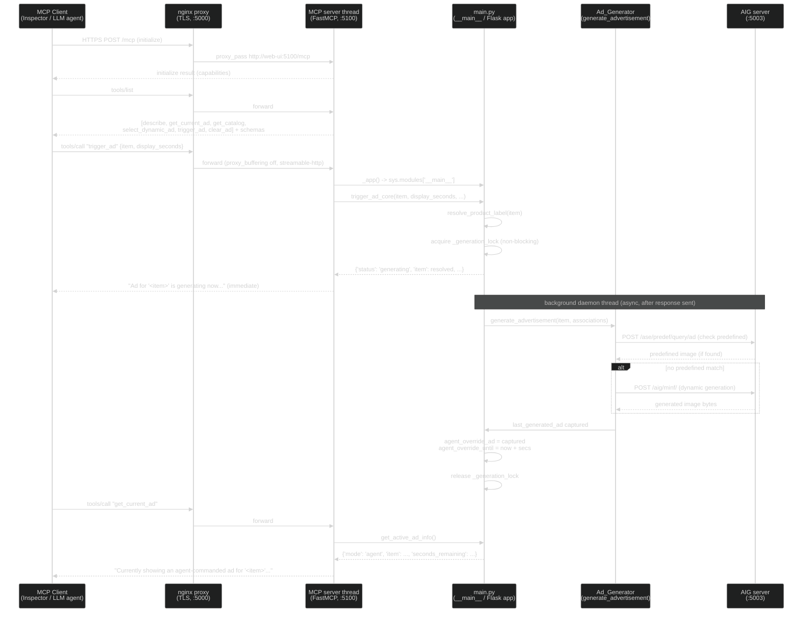
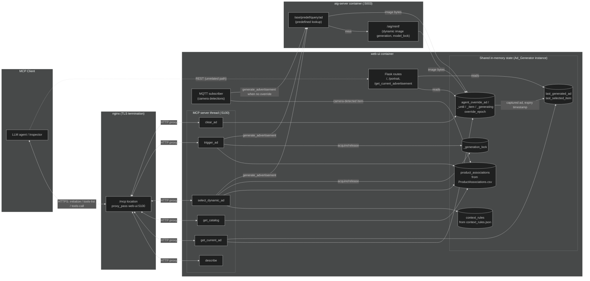

# MCP Server Architecture

Technical reference for how the Digital Signage MCP server is implemented, how a client
discovers and calls its tools, and how each tool relates to existing application code.
See [use-mcp-agent-tools.md](use-mcp-agent-tools.md) for end-user connection instructions.

## Overview

The MCP server ([web-ui/mcp_server.py](https://github.com/intel-retail/digital-signage/blob/main/web-ui/mcp_server.py)) runs in-process
alongside the Flask app in the `web-ui` container, on port `5100`, using the `FastMCP`
Streamable HTTP transport. It is started as a daemon thread from
[web-ui/main.py](https://github.com/intel-retail/digital-signage/blob/main/web-ui/main.py) after `initialize_app()` completes, so a
failure to import `mcp` or bind the port only disables the MCP thread — Flask, MQTT,
and AIG keep running.

Because it runs in the same process as `main.py`, tool implementations call shared
in-memory state directly (via `sys.modules['__main__']`) instead of making HTTP
requests to the REST API.

Externally, the server is reached through the nginx proxy at `/mcp`
(`configs/nginx/nginx.conf`), which forwards to `http://web-ui:5100` and terminates TLS.

## How a client discovers and calls tools

This follows the standard MCP protocol handshake — no custom discovery code:

1. **Registration**: each Python function decorated with `@mcp.tool()` in
   `mcp_server.py` is auto-registered by the `FastMCP` SDK. The tool name is the
   function name; the input schema is derived from the function's type-annotated
   parameters; the description shown to clients is the function's docstring.
2. **`initialize`**: client opens a Streamable HTTP connection to `/mcp` and sends
   `initialize`.
3. **`tools/list`**: client requests the tool catalog; the server returns all
   registered tools with their descriptions and JSON-schema parameters.
4. **`tools/call`**: client invokes a tool by name with arguments; FastMCP dispatches
   to the corresponding Python function and returns its string return value as the
   result.

The `describe` tool exists as a convenience for agents that prefer reading a single
natural-language capability summary instead of parsing the schema.

## Tools added

| Tool | Signature | Purpose |
| --- | --- | --- |
| `describe()` | → str | Static capability summary for the agent |
| `get_current_ad()` | → str | What's currently on screen (camera / agent / generating) |
| `get_catalog()` | → str | Lists products and their cross-sell promos |
| `select_dynamic_ad()` | `(weather, demand, age_mix, daypart, display_seconds, benchmark)` → str | Resolves a shopping context to a product and displays its ad |
| `trigger_ad()` | `(item, display_seconds, promo_text, slogan)` → str | Directly displays a named catalog item's ad |
| `trigger_video_ad()` | `(item, description)` → str | Displays a looping video ad, live on screen for `VIDEO_AD_DISPLAY_SECONDS` (default 5s); exactly one of `item` (a catalog product; predefined video if provisioned, else AI-generated with catalog overlays) or `description` (free text describing the video directly) is required — not both, since their overlays/content would be unrelated; MCP-triggered only |
| `clear_ad()` | → str | Clears the agent override, returns to camera-driven flow |

## New implementation vs. reuse of existing code

| Tool | Underlying code | New vs. reused |
| --- | --- | --- |
| `describe` | Inline string, no backing function | Fully new, MCP-only |
| `get_current_ad` | `get_active_ad_info()` | New function, but reads the existing `agent_override_*` / `last_selected_item` state — the same state `Ad_Generator.get_current_advertisement()` (used by the existing `/get_current_advertisement` REST route) already checks. Also reports the new `video_override_*` state (see `trigger_video_ad`) |
| `get_catalog` | `get_catalog_summary()` | New function built entirely on the existing `product_associations` dict, already populated from `ProductAssociations.csv` for the camera-driven flow |
| `trigger_ad` | `trigger_ad_core()` | New orchestration function; calls the pre-existing `resolve_product_label()` and the pre-existing core engine `Ad_Generator.generate_advertisement()` (same method the MQTT/camera pipeline uses). Introduces new state: `agent_override_ad/_until/_item/_generating`, `override_epoch` |
| `select_dynamic_ad` | `select_dynamic_ad_core()` + `resolve_context_to_product()` + `load_context_rules()` | New feature end-to-end (new `context_rules.json` config, new matching logic), but delegates final ad rendering to the same existing `generate_advertisement()` engine |
| `trigger_video_ad` | `trigger_video_ad_core()` + `Ad_Generator.generate_video_ad()` | Fully new, MCP-only video path with its own isolated state (`video_override_media/_until/_item/_generating`, `_video_generation_lock`). Predefined videos are looked up directly by product name (new `product_video_paths` dict from a new `pre_defined_ad_video` CSV column, mimetype detected from file extension) with no ChromaDB/AIG involvement. When no predefined video exists it calls a new AIG endpoint, `/aig/mvid/` (`Text2VideoPipeline`/LTX-Video model, separate from the existing image model), which generates genuinely temporally-related frames in a single call and returns an already-encoded looping animated WEBP (`image/webp`). AIG-side: new `videoinf.py` resource, new `AigServerMetadata` video-model config/singleton, and the promo/frame/logo overlay logic was extracted into a shared `apply_ad_overlays()` helper reused by both the image and video endpoints |
| `clear_ad` | `clear_agent_override()` | Fully new; manipulates the new override state fields |

**Notes:**

- Despite docstrings stating some core functions are "shared by the REST route and the
  MCP tool," there is currently no REST route calling `trigger_ad_core` or
  `select_dynamic_ad_core` — only `/`, `/portrait`, and `/get_current_advertisement`
  exist as Flask routes today.
- The genuine reuse point across the camera-driven flow and the new MCP action tools
  is `Ad_Generator.generate_advertisement()` — the image-generation engine that calls
  the AIG server's `/ase/predef/query/ad` and `/aig/minf/` endpoints is unchanged in
  interface and shared by both paths.
- On the AIG server side, the same change hardened (but did not add new endpoints to)
  the existing `/aig/minf/` inference API: a `model_lock` was added for thread-safety
  and the Flask app was switched to `threaded=True`, since MCP tools can now trigger
  concurrent generation requests that didn't previously occur.
- `trigger_video_ad` reads its own `AIG_VIDEO_INFERENCE_DEVICE` env var (web-ui) to
  pick the `device` sent to `/aig/mvid/`, kept deliberately separate from the image
  path's `AIG_INFERENCE_DEVICE`. It must match the AIG server's `AIG_VIDEO_MODEL_DEVICE`
  (same `.env` source variable) or the server can't reuse its preloaded video
  pipeline and rebuilds it from disk on every call.

## Control flow — client connecting and calling a tool

## Data flow — state and payloads across components

**Key control-flow points:**

- All 6 tools are dispatched through the single FastMCP thread; each calls back into
  `main.py`'s module-level functions via `_app()` (same process, no HTTP hop internally).
- `trigger_ad` / `select_dynamic_ad` return immediately (status `generating`) while the
  actual image generation runs in a separate daemon thread — the MCP call never blocks
  on the AIG round-trip (except when `benchmark=True`).
- `_generation_lock` + `override_epoch` prevent two concurrent generations (agent vs.
  camera-driven, or agent vs. a `clear_ad` mid-flight) from corrupting shared state.

**Key data-flow points:**

- `agent_override_*` fields are the single hand-off point between MCP tools and the
  display: both the REST `/get_current_advertisement` route and MCP's `get_current_ad`
  read the same override state.
- `product_associations` (CSV) and `context_rules` (JSON) are load-once, read-many
  configuration feeding both the camera-driven MQTT path and the new MCP tools.
